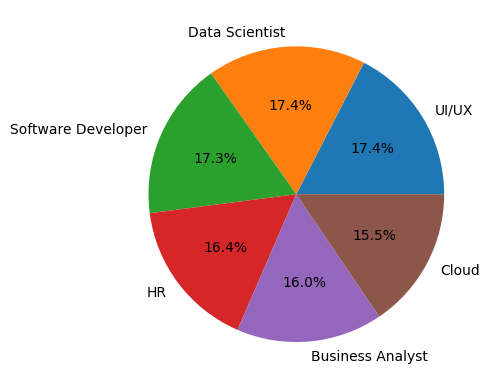
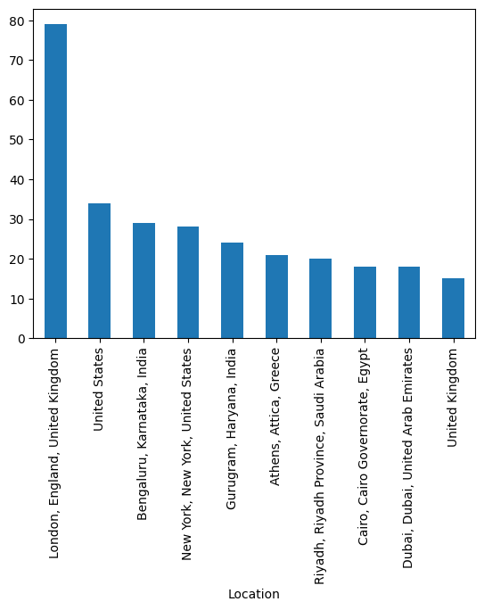
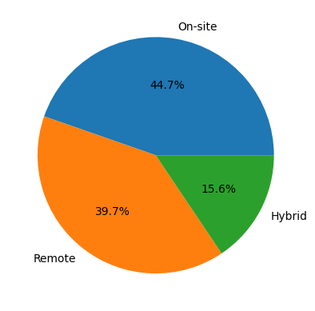

# it-job-market-analyser
Data analysis project using Python, Pandas and Matplotlib to explore vacancies and visualize trends.

# IT Job Market Analyzer

## Description

Analysis of IT job vacancies using Pandas and Matplotlib.
The project explores job demand, locations, remote work opportunities, and employment types.

## Software and libraries being used

- Python
- Pandas
- Matplotlib
- Jupyter Notebook

## Project Structure

- **data/** – raw and processed datasets  
- **notebooks/** – data cleaning and analysis  
- **reports/** – visualizations and results  
- **src/** – reusable Python functions

## Key Insights

- The IT job market is highly concentrated in a few key roles and locations.
- Remote work remains a significant part of the market.
- Full-time employment is the dominant job type across listings.

## Job Titles Distribution

Most job postings are concentrated in a small number of core IT roles, mainly backend, data, and software development positions.

## Job Locations

Job opportunities are highly concentrated in a few countries/cities, with strong dominance of major tech hubs and remote options.

## Remote vs On-site

Most IT job offers tend to favor either remote or onsite work, showing a strong shift away from hybrid positions.

## Conclusion

The analysis of the IT job market reveals several key trends:

1. Data Scientist and UI/UX Designer are the most in-demand roles (17.4%).
2. London is the leading location with the highest number of vacancies (79).
3. Remote positions account for 39.7% of listings.
4. Full-time positions dominate the market (846 vacancies).

## Source of data

https://www.kaggle.com/datasets/moyukhbiswas/job-postings-dataset
